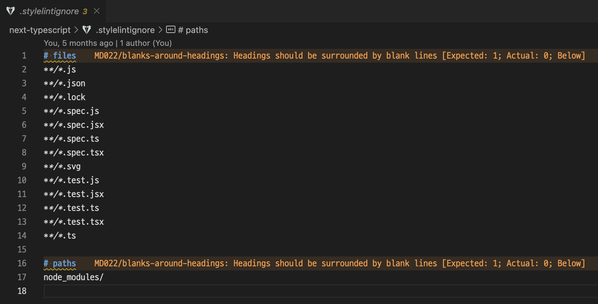

어느날 갑자기 .stylelintignore 파일을 수정했더니 Markdown lint가 반영되는 문제가 생겼어요.

예를 들어

<br />

```text
**/*.js
**/*.svg
```

<br />

이렇게 경로를 입력하고 저장했더니

<br />

```markdown
**/\*.js
**/\*.svg
```

<br />

이렇게 슬래시가 escape 되어버리는 것이 아니겠어요.

그것도 아무 이유 없이 갑자기.😦

<br />



이랬던 코드가


이렇게 되어버립니다.

Markdown lint 에러가 발생한 것이죠.


<br />

원인을 모르니 해결 방법도 알 길이 없었어요.

다른 사람은 이런 일을 겪은 적이 없는지 비슷한 경우조차 찾을 수 없었고요.

ChatGPT에서 알아보고, 구글에서 검색해보고, VS Code 확장 프로그램에서도 관련된 것이 있나 찾아보고 별짓을 다했는데도 도무지 알 길이 없는 절망적인 상황.

그런데 이런 노력이 무색하게도 settings.json에 `".stylelintignore": "ignore"` 딱 한 줄을 추가하고 나니까 거짓말처럼 문제가 사라졌습니다.

<br />

```json
{
  "files.associations": {
    ".stylelintignore": "ignore"
  }
}
```

<br />

메데따시 메데따시🎉🎉

혹시라도 비슷한 문제가 생기면 파일명 또는 파일 확장명과 함께 `ignore`를 추가해보세요.

VS Code가 마음대로 코드를 formatting하는 문제를 해결할 수 있을 거예요.
