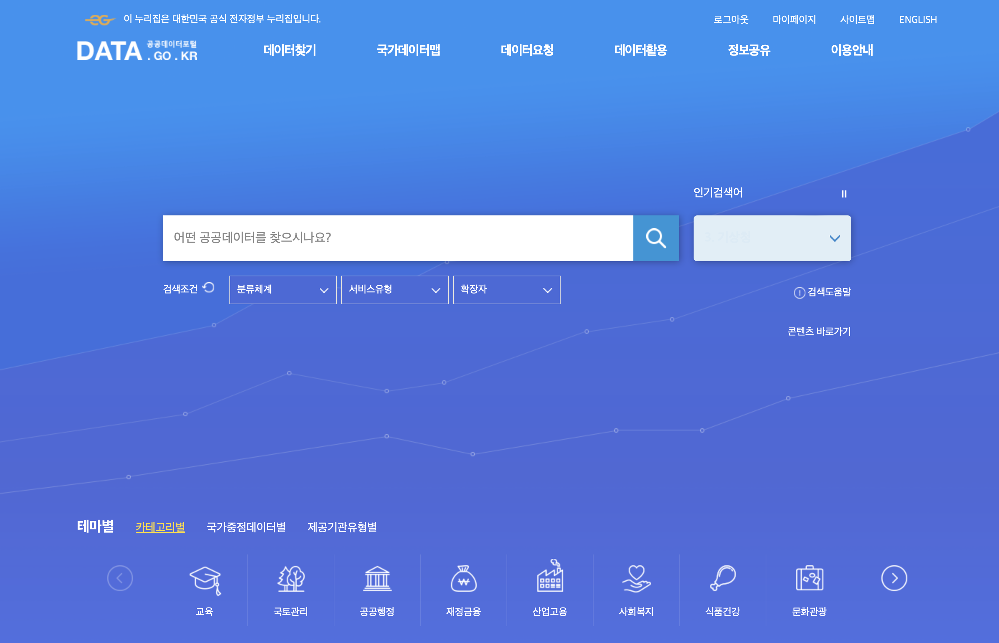
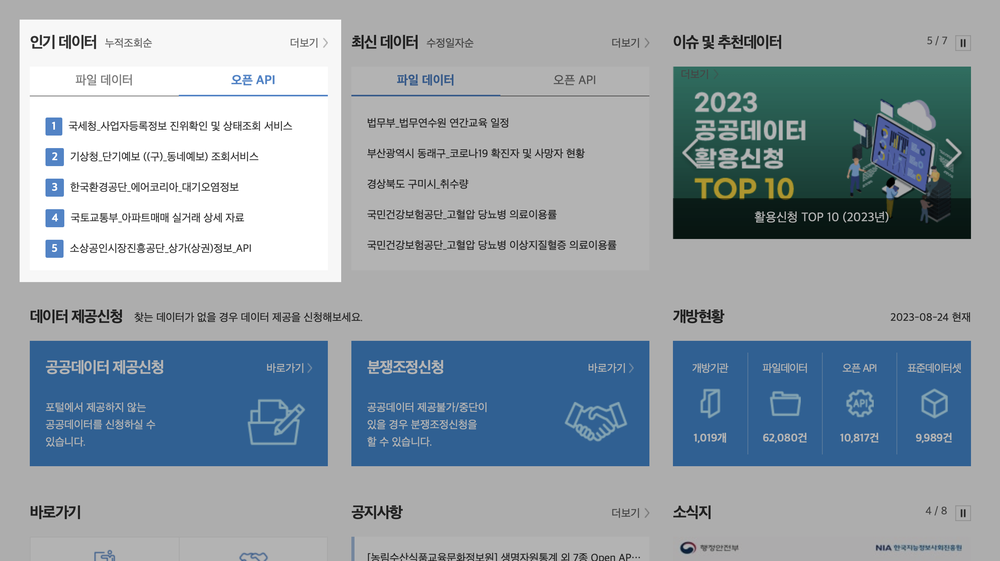
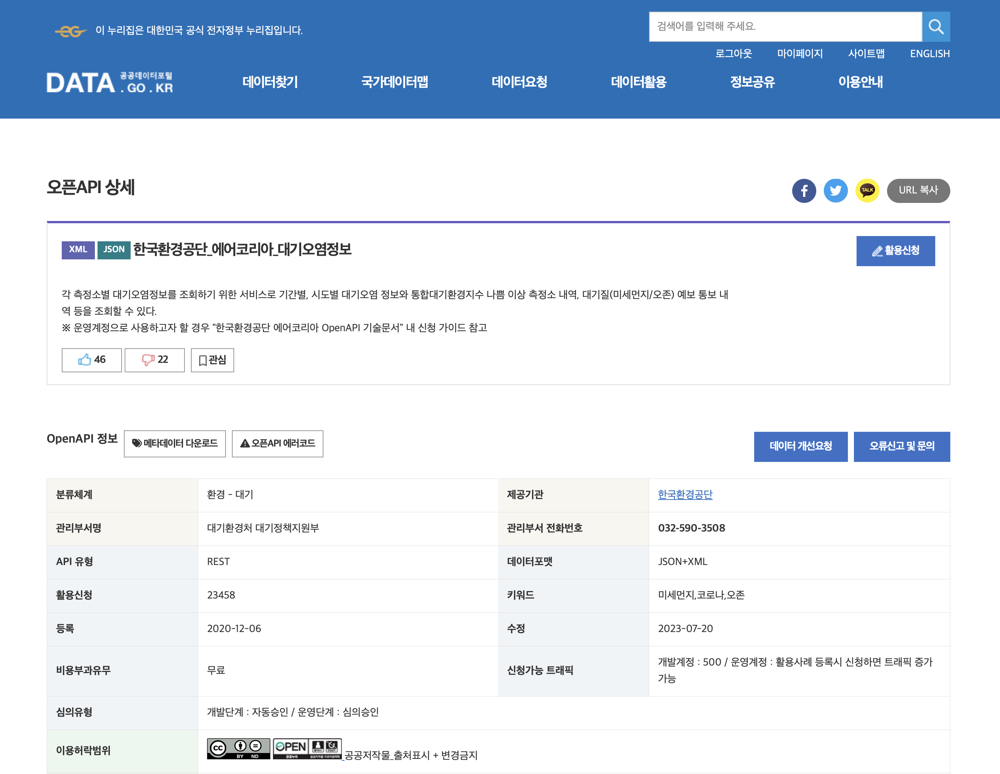
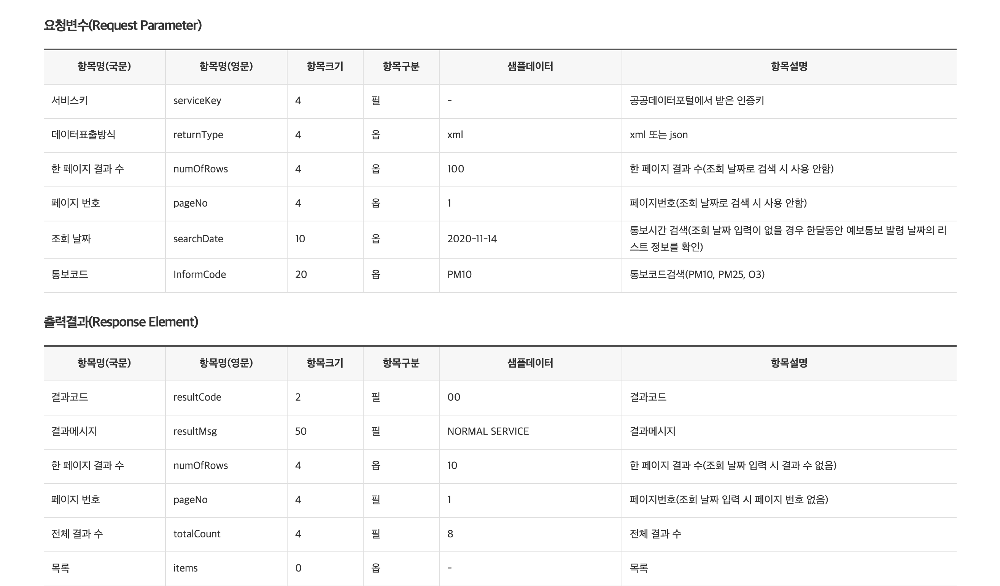
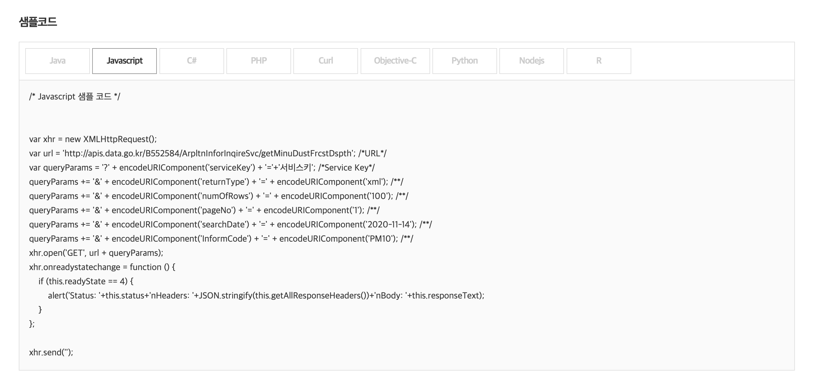
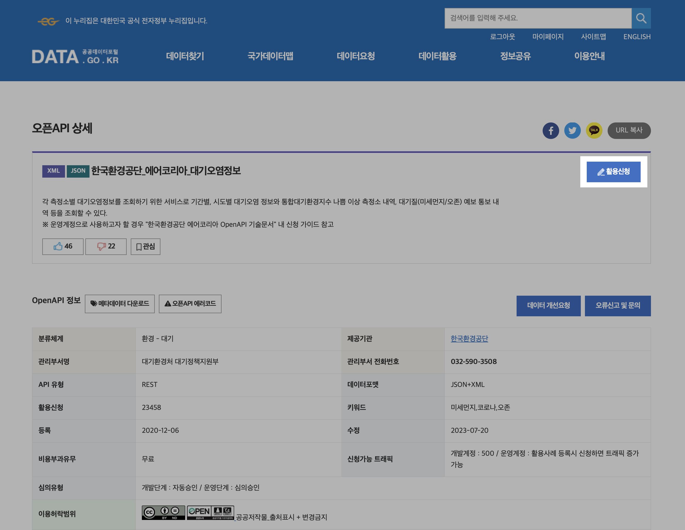
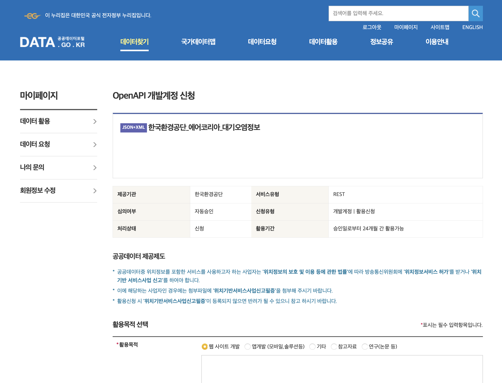
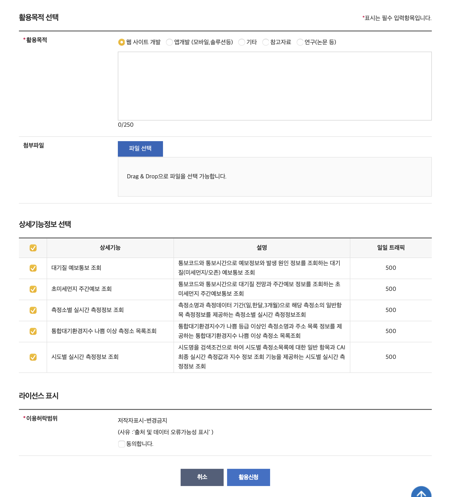
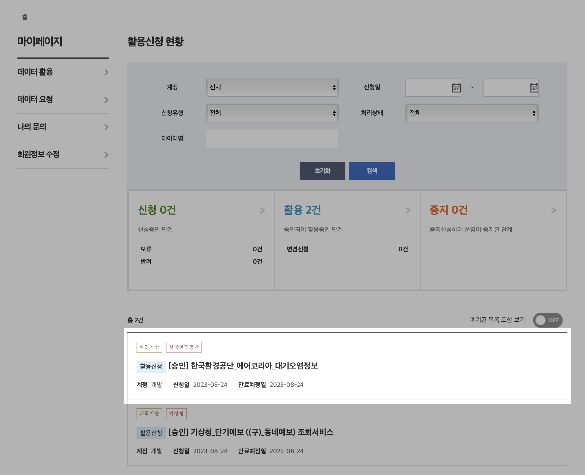
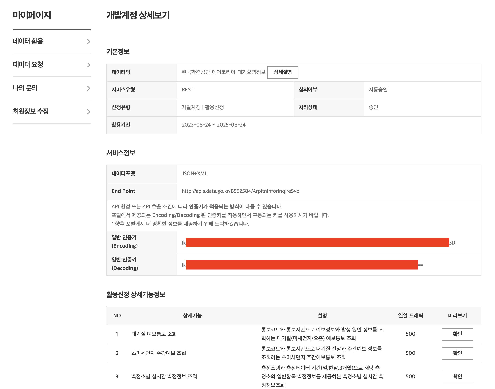

[공공데이터포털](https://www.data.go.kr/index.do)은 정부기관이 운영하는 기관에서 제공하는 다양한 데이터를 무료로 사용할 수 있는 곳이에요. 여기서 필요한 데이터를 사용하는 방법을 함께 알아볼게요.

 

## 회원가입

먼저 회원가입을 해야 해요. 데이터 활용을 요청하려면 로그인을 해야 하거든요.

네이버나 카카오 계정으로도 편리하게 가입할 수 있어요.

 

## 필요한 데이터 찾기

공공데이터포털에서는 개발에 필요한 데이터를 검색할 수 있어요.

여기서는 인기 데이터 중에 하나를 사용해볼게요. '한국환경공단\_에어코리아\_대기오염정보'를 선택합니다.

 

## 상세화면

상세화면으로 들어가면 API와 관련된 다양한 정보를 확인할 수 있어요. 특히 API를 요청하는 샘플 코드도 제공한다는 점은 인상깊었어요. API 요청을 어떻게 하는지 모르는 사람은 샘플 코드를 보면서 도움을 받을 수 있을 거라고 생각해요.

API를 활용하기 위해서는 신청서를 제출해야 해요. '활용신청' 버튼을 클릭해서 신청해볼게요.

 

## 활용 신청

신청 화면으로 들어가면 서비스 유형, 활용 기간 등 API를 사용하면서 알아둬야 할 정보를 확인할 수 있어요.

여기서 활용 목적을 간략하게 적고 이용허락범위 동의를 확인하면 신청이 완료돼요. 저는 신청할 때 "공공데이터포털 API 활용 테스트"라고만 적었어요.

 

## 승인 여부 확인

신청이 완료된 후에는 승인 여부를 확인할 수 있는 화면으로 넘어가요. 신청 목록에서 방금 신청한 데이터 화면으로 이동하면 인증키를 확인할 수 있어요.

여기서 일반 인증키 둘 중 하나를 데이터 요청 쿼리에 추가하면 정상적으로 데이터를 받을 수 있어요.

끝!!

[공공데이터포털 바로 가기](https://www.data.go.kr/index.do)
