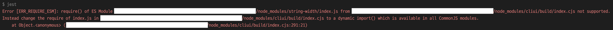

## 사건의 발단

Jest로 테스트 파일을 실행했더니 다음과 같은 에러가 발생했어요.

<br />

```bash
Error [ERR_REQUIRE_ESM]: require() of ES Module ~/node_modules/string-width/index.js from ~/node_modules/cliui/build/index.cjs not supported.
Instead change the require of index.js in ~/node_modules/cliui/build/index.cjs to a dynamic import() which is available in all CommonJS modules.
    at Object.<anonymous> (~/node_modules/cliui/build/index.cjs:291:21)
```



<br />

이 에러는 ts-node에서 발생시키는 것 같아요. 그래서 ts-node 문서에서 제시한 에러 해결 방법을 찾아 이렇게 저렇게 개발 환경 설정을 바꿔봤지만 문제 해결이 안 되더라고요.

그렇다고 의존성 패키지를 직접 수정하는 건 좋은 방법이 아니고요.

<br />

## 사건 해결

결국 yarn 캐시 때문에 문제가 발생한다는 결론을 얻었어요(npm이나 pnpm 같은 다른 패키지 관리자에서도 발생하는지는 모르겠어요). 실제로 캐시를 제거하고 의존성 패키지를 다시 설치했더니 문제가 사라졌어요.

다음 순서대로 캐시를 삭제하고 패키지를 재설치해보세요.

<br />

1. 캐시 제거

```bash
yarn cache clean
```

2. node_modules 폴더와 yarn.lock 파일 삭제

3. 의존성 패키지 재설치

```bash
yarn install
```

<br />

참고로 캐시를 제거하지 않고 패키지만 재설치하면 당장은 잘 되는 듯해도 시간이 지나면 에러가 다시 발생할 확률이 높아요. 캐시를 꼭 제거해주세요.

<br />

## 참고 자료

[Running Jest resulted in the error 'Error \[ERR_REQUIRE_ESM\]: require\(\) of ES Module', which was resolved.](https://tsukurue.com/en/archives/935)  
[Common errors from ts-node](https://www.npmjs.com/package/ts-node#err_require_esm)
