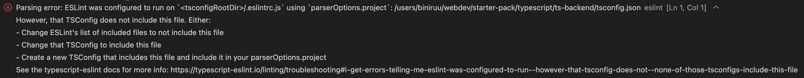

## 사건의 발단

타입스크립트 프로젝트 환경 설정할 때, eslint나 prettier 같은 설정 파일은 확장자명을 `.ts`가 아닌 `.js`를 사용하게 되는데요. 이럴 경우에 .eslintrc.js 파일에서 다음과 같은 에러가 발생하는 경우가 생겨요.

<br />

```text
Parsing error: ESLint was configured to run on `<tsconfigRootDir>/.eslintrc.js` using `parserOptions.project`: /users/biniruu/webdev/starter-pack/typescript/ts-backend/tsconfig.json
However, that TSConfig does not include this file. Either:
- Change ESLint's list of included files to not include this file
- Change that TSConfig to include this file
- Create a new TSConfig that includes this file and include it in your parserOptions.project
See the typescript-eslint docs for more info: https://typescript-eslint.io/linting/troubleshooting#i-get-errors-telling-me-eslint-was-configured-to-run--however-that-tsconfig-does-not--none-of-those-tsconfigs-include-this-file
```



<br />

webpack.config.js에서도 발생하는 걸 보니 다른 몇몇 `.js` 파일에서도 같은 문제가 발생하는 듯해요.

이 에러가 발생하면 eslint가 동작을 하지 못해요. 그렇기 때문에 반드시 해결해야 하죠.

<br />

## 원인 추측

제 생각에는 다음 조건에서 이 에러가 발생하는 것 같아요. 물론 제 경험에 의한 것이니만큼 얼마든지 다른 환경에서 문제가 발생할 수도 있어요.

1. create-react-app이나 create-next-app처럼 자바스크립트 라이브러리/프레임워크를 사용하는 환경이 아니어야 해요.
1. tsconfig.json에서 `allowJS`를 `false`로 설정해야 해요.
1. eslint 설정 파일에서 `parser`를 `@typescript-eslint/parser`로 설정해야 해요.

<br />

## 사건 해결

### tsconfig.json에 파일명 추가하기

`include` 목록에 eslint 설정 파일을 추가해요.

<br />

```json
{
  "include": [".eslintrc.js"]
}
```

<br />

이렇게 하면 에러가 사라져요. eslint도 정상적으로 동작하죠.

그렇지만 `.js` 파일에서는 발생하면 안 되는(tsconfig.json에서 `allowJS: false`로 설정했기 때문) 타입 에러가 `.js` 파일에서도 발생하는 대참사가 벌어져요. 이 에러는 `@ts-ignore`나 `@ts-nocheck`로도 없앨 수가 없기 때문에 에러마다 일일이 `eslint-disable` 주석을 붙여줘야 하죠.

<br />

### eslint 설정 파일에서 .js 파일을 override 하기

.eslintrc.js 파일에서 `overrides` 옵션에 다음 설정을 추가해요.

<br />

```javascript
module.exports = {
  overrides: [
    {
      extends: ['plugin:@typescript-eslint/disable-type-checked'],
      files: ['*.js', '*.cjs'],
    },
  ],
}
```

<br />

이렇게 하면 아무런 부수효과 없이 문제를 해결할 수 있어요. 제가 추천하는 방법이기도 하면서 이 글을 쓴 이유기도 해요.

같은 문제를 만난 분 모두 이 방법으로 어둠의 통로에서 탈출하시기 바라요.🙌🏻
