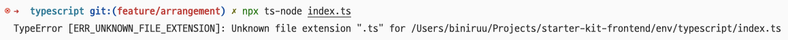

## 사건의 발단

index.ts 파일 실행을 위해 `npx ts-node index.ts`를 실행하니 다음과 같은 에러가 발생했어요.



## 사건 해결

tsconfig.json에서 `compilerOptions.esModuleInterop` 옵션을 `true` 로 설정합니다.

<br />

```json title=package.json
{
  "compilerOptions": {
    "esModuleInterop": true
  }
}
```

<br />

이제 ts-node 명령어에 `--esm` 옵션을 붙여서 실행하면 문제 없이 실행될 거예요.

<br />

```bash
npx ts-node --esm index.ts
```
